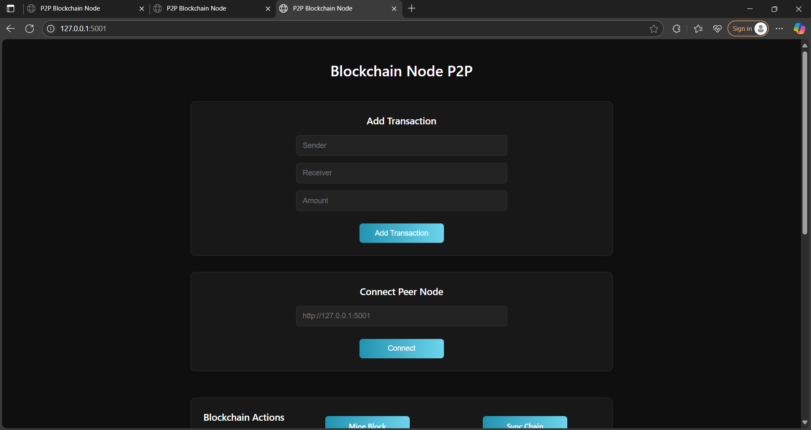
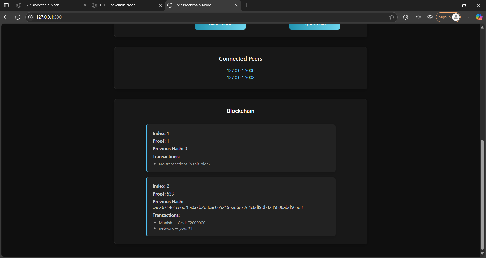

# 🧱 P2P Blockchain Node Simulation (Flask + Python)

This project simulates a basic **peer-to-peer blockchain network** using Flask. Each node maintains its own chain, can create transactions, mine new blocks, connect to other nodes, and sync its chain with peers.

The purpose is to help understand how blockchain systems work underneath — including concepts like proof of work, consensus, mining, and peer syncing — all in a simple visual UI.

Features

- Add and view transactions via a user-friendly dark-themed interface
- Mine new blocks (Proof-of-Work)
- Connect to peer nodes
- Sync your blockchain with the longest valid chain on the network
- View all connected peers and the current blockchain

How It Works

Adding Transactions
Users can create a transaction by providing:
- Sender
- Receiver
- Amount

These transactions are stored temporarily in memory until a block is mined.

Mining (Proof-of-Work)

Mining adds the pending transactions to a new block.

When you click "Mine Block":
1. The system fetches the last block's **proof value**
2. It runs a **Proof-of-Work algorithm**:
3. It calculates the new proof through trial-and-error
4. Once a valid proof is found:
- A new block is created
- The block is added to the chain
- Transactions are cleared

Chain Syncing (Consensus)

Blockchain networks can split or fall out of sync. To resolve this, we implement a **Longest Chain Rule**:

- When you click **"Sync Chain"**, the node checks all known peers
- If any peer has a longer and valid chain, the node replaces its own chain

Project Structure

p2p_blockchain/
├── app.py / node1.py # Flask app (one per node)
├── templates/
│ └── index.html # Frontend UI
├── static/
│ └── style.css # Dark theme styling
├── README.md

Run the Project

Install dependencies:

pip install flask requests

# Start node 1
python node1.py    # Runs on port 5000

# Start node 2
python node2.py    # Runs on port 5001

UI Preview
Modern dark-themed dashboard with panels to:

- Add transactions
- Connect peers
- Mine blocks
- View connected nodes and blockchain

Screenshots!!

Endpoint             
- [GET]`/`                : UI dashboard for each node         
- [GET]`/get_chain`       : Returns full blockchain             
- [POST]`/add_transaction` : Adds a new transaction              
- [GET]`/mine_block`      : Mines a new block (PoW)             
- [POST]`/connect_node`    : Registers a peer node               
- [GET] `/replace_chain`   : Consensus: replaces with longer chain 
- [GET]`/get_nodes`       : Lists connected peer nodes          

